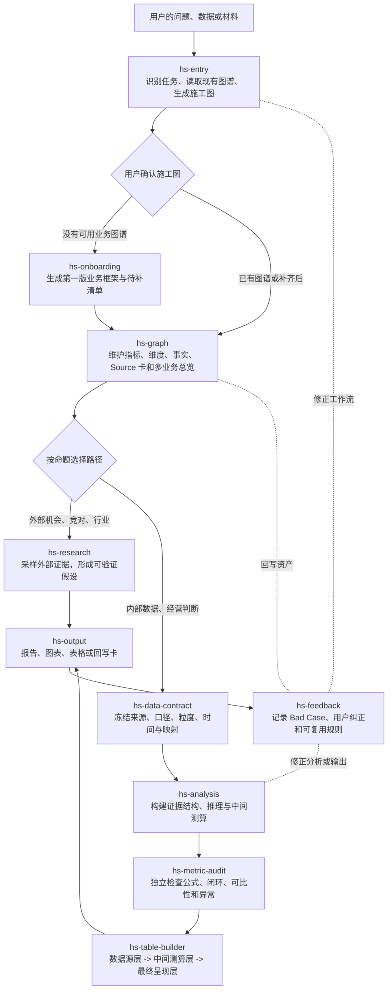

# Hs Data Assistant

[](LICENSE)
[](CHANGELOG.md)

Hs 是一组面向真实经营问题的数据助手 Skill。它不把 AI 当成“替你写一段话”的工具，而是帮助你把业务、指标、数据源和经验组织成可继续使用的资产，再完成分析、复盘、研究和交付。

## 你会得到什么

- 一张可持续生长的业务认知地图，而不是一次性的 Prompt。
- 一套可追溯的指标树、维度、业务事实和 Source 卡。
- 对复杂数据任务的固定发布链：先确认数据边界，再分析、审计、建表、输出。
- 一次任务里形成的结论、表格和缺口，可以回写为下一次任务可复用的资产。

Hs 不承诺替你创造不存在的数据、让组织自动讲理，或用一套模板解决所有行业问题。它的价值在于：让 AI 更准确地理解你真实负责的工作，并让你的判断可证明、可复用、可迁移。

## 适合谁

- 需要反复做经营分析、复盘、汇报、目标测算或方案论证的人。
- 想把零散报表、数据表和业务经验沉淀为长期资产的人。
- 希望 AI 能参与真实工作判断，而不只是在最后帮忙润色文字的人。

## Skill 如何协作



一句话理解：`hs-entry` 决定怎么做，`hs-onboarding / hs-graph` 维护你理解业务所需的资产，`hs-analysis / hs-research` 完成判断，`hs-data-contract / hs-metric-audit / hs-table-builder` 保障数据型任务可靠，`hs-output` 负责把结论讲清，`hs-feedback` 让系统越用越准。

完整架构见 [docs/architecture.md](docs/architecture.md)。

## 运行环境：核心通用，适配器可选

Hs 的核心不是某一个客户端里的按钮，而是仓库中的 Markdown 方法、业务图谱、指标树和 Source 卡协议：

- `skills/`：通用工作流，可被任何能读取项目文件或长期指令的 AI 环境使用。
- `templates/`：可复制的业务图谱与回写模板。
- `scripts/sync-to-codex.sh` 与 `agents/openai.yaml`：仅是 Codex 的便捷适配器，不是 Hs 的能力边界。

目前 Codex 支持一键安装和命名调用；其他 AI 环境可通过项目知识库、长期指令或文件上传接入。能力差异与最小接入包见[平台适配说明](docs/platform-adapters.md)。

## 20 分钟跑通 Demo

```bash
git clone https://github.com/bleo-labs/hs-data-assistant.git
cd hs-data-assistant
./scripts/validate-package.py
./scripts/bootstrap-demo.sh
```

然后根据你的 AI 环境选择接入方式：

- **Codex**：额外运行 `./scripts/sync-to-codex.sh`，刷新后使用 `$hs-entry` 调用。
- **其他兼容环境**：把 `skills/` 作为项目长期指令或知识文件接入，并把 Demo 图谱目录作为本次任务材料。具体方式见[平台适配说明](docs/platform-adapters.md)。

以下是与环境无关的任务表达：

```text
请使用 demo-two-sided-market，分析 2026 年 5 月收入变化的主要原因。
```

Hs 应先读取 Demo 图谱、生成施工图并等待确认。确认后才会进入数据契约、分析、审计和输出。详见 [Demo 演练](docs/demo-walkthrough.md)。

需要演示完整业务图谱、固定种子合成数据、五类任务和标准答案时，使用[全渠道零售完整 Demo](docs/full-demo-walkthrough.md)。

## Skill 组合

| Skill | 作用 |
|---|---|
| `hs-entry` | 入口分发、Graph Scan、任务施工图 |
| `hs-onboarding` | 第一版业务认知地图和指标树骨架 |
| `hs-graph` | 多业务图谱、指标、维度、Source 卡与索引维护 |
| `hs-data-contract` | 计算前冻结数据源、口径、粒度、映射和空值语义 |
| `hs-analysis` | 证据结构、业务推理和中间测算 |
| `hs-metric-audit` | 发布前独立检查闭环、可比性、分子分母和异常 |
| `hs-table-builder` | 构建数据源层、中间测算层、最终呈现层 |
| `hs-research` | 外部研究、对标与样本扫描 |
| `hs-output` | 报告、图表、HTML、Excel 等输出契约 |
| `hs-feedback` | Bad Case 分类、回写与系统改进路由 |

## 私有数据

真实业务图谱、原始数据和输出报告都应保留在本地私有工作区。仓库默认忽略 `business_graphs/`、`outputs/` 和 `private/`。提交 Issue 前请先阅读 [数据与隐私边界](SECURITY.md)。

## 开源许可

Hs Data Assistant 使用 [Apache License 2.0](LICENSE)。你可以免费使用、修改和分发这套 Skill，包括用于商业环境；再分发时需要保留许可证和版权声明。本仓库不包含维护者的咨询、部署或持续答疑服务。

## 开发与同步

这个仓库是 Hs 的产品真源。修改 `skills/` 后先运行：

```bash
./scripts/validate-package.py
```

若你恰好在 Codex 本机环境使用，再额外运行：

```bash
./scripts/sync-to-codex.sh
```

不要直接修改 `~/.codex/skills/hs-*`，那里只是 Codex 的同步副本。

两台电脑或多个 AI 工作环境如何共用同一真源，见 [多环境协作](docs/multi-environment-workflow.md)。

## 版本状态

当前为 `v0.2.0` 公开测试版本。更新见 [CHANGELOG.md](CHANGELOG.md)。
