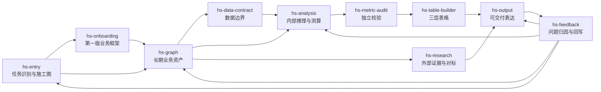

# 架构

Hs Data Assistant 有三层长期资产。

## Skill 协作总览



这不是一条每次都必须走完的流水线：

- 没有业务图谱时，先走 `hs-onboarding -> hs-graph`。
- 外部研究命题以 `hs-research` 为主，不强行经过数据契约和建表。
- 标准或重型内部数据任务必须经过 `hs-data-contract -> hs-analysis -> hs-metric-audit -> hs-table-builder`。
- 任何任务出现漏读、口径冲突、结论不可用或用户纠正时，都通过 `hs-feedback` 回写到真正需要修正的模块。

## 1. 技能层：工作方法

Skills 定义 Agent 应该如何工作。

```text
hs-entry -> hs-onboarding / hs-graph / hs-research
          \-> Graph Scan -> 用户确认施工图
              \-> hs-data-contract -> hs-analysis -> hs-metric-audit
                  -> hs-table-builder -> hs-output
                                   \-> hs-feedback
```

这些技能是可复用方法，不能写入具体私有业务规则。

对需要内部数据读取、计算或表格交付的标准/重型任务，施工图必须先读取真实业务图谱、指标索引和 Source 卡，再进入数据契约。数据契约只能使用 Graph Scan 已确认的路径；审计未放行的中间结果不得进入最终表或报告。

## 2. 业务图谱层：业务专属资产

业务图谱用于存放某个具体业务的专属资产：

```text
business_graphs/
  registry.md
  {business_id}/
    manifest.md
    business_nodes/
    metrics/
    dimensions/
    hierarchies/
    facts/
    sources/
    bindings/
    indexes/
    maps/
```

`registry.md` 是多业务入口，用来选择当前要使用哪棵业务树。每个 `manifest.md` 是单棵业务图谱的总览。

## 3. 交付产出层：任务结果

Outputs 是具体任务产生的交付物，例如报告、表格、图表、施工图、回写卡和交接包。

输出物可能暴露业务图谱哪里不完整，但输出物不能替代业务图谱。需要长期保留的变化，应该通过 `hs-graph` 写回。

## 4. 反馈回路：系统自我修正

Feedback 记录系统在哪里失败，并判断应该修改哪一个真源：

- 业务图谱资产问题 -> `hs-graph`
- 路由或施工图问题 -> `hs-entry`
- 分析方法问题 -> `hs-analysis`
- 数据源、口径、粒度、映射或空值语义问题 -> `hs-data-contract`
- 父子闭环、可比性、分子分母、Join、排名或异常问题 -> `hs-metric-audit`
- 最终表复杂计算、输入结果混淆或公式隐藏错误 -> `hs-table-builder`
- 研究方法问题 -> `hs-research`
- 输出可读性问题 -> `hs-output`
- 第一版业务地图逻辑问题 -> `hs-onboarding`

Feedback 应该先停止当前任务，分类问题，再决定是否修改系统，避免把一次偶发失败偷偷固化成永久规则。

## 核心规则

`hs-onboarding` 和 `hs-graph` 使用同一套业务图谱文件契约。Onboarding 负责创建第一版，Graph 负责长期维护。
