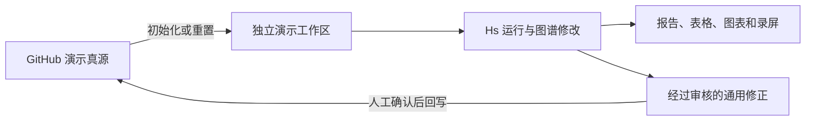

# 完整 Demo 双层环境契约

这份文档规定 Hs 完整演示业务的公开真源与独立演示工作区如何分工。完整建设施工图见 [full-demo-project-graph.md](full-demo-project-graph.md)。

## 1. 两层环境

### GitHub 可公开真源

位置：

```text
packages/hs-data-assistant/
```

职责：

- 保存通用 Hs Skills、公开模板和演示真源。
- 保存虚拟业务图谱、合成数据生成规则、演示任务和标准答案。
- 接受版本控制、链接校验、指标校验和隐私扫描。
- 不保存日常试验输出、录屏文件或临时修改。

完整演示业务的目标结构：

```text
examples/business_graphs/demo-omnichannel-retail/
  manifest.md
  design/
    business-model.md
    metric-blueprint.md
    scenario-ground-truth.md
    data-design.md
  business_nodes/
  metrics/
  dimensions/
  hierarchies/
  facts/
  sources/
  bindings/
  indexes/
  maps/
  datasets/
    raw/
    bad_samples/
    audit/
  generator/
    generate_demo_data.py
    validate_demo_data.py
    build_demo_task_evidence.py
  tasks/
    TASK-0001-may-decline.md
    TASK-0002-region-performance.md
    TASK-0003-target-pressure.md
    TASK-0004-new-category.md
    TASK-0005-source-error.md
    evidence/
    expected_answers/
```

现有 `demo-two-sided-market` 保留，用于快速验证安装和基础调用；完整 Demo 不替换它。

### 独立演示工作区

建议位置：

```text
~/HS_Public_Demo_Workspace/
```

职责：

- 作为独立 AI 项目和独立 Obsidian Vault 使用。
- 用于拍摄、截图、运行任务、修改图谱和生成交付物。
- 只从 GitHub 公开真源初始化。
- 可以随时删除并重新生成。
- 不得引用或挂载私有工作区中的 `business_graphs/`、数据表和输出物。

目标结构：

```text
HS_Public_Demo_Workspace/
  AGENTS.md
  README.md
  .agents/
    skills/
  business_graphs/
    registry.md
    demo-omnichannel-retail/
  demo_projects/
    active/
    completed/
  outputs/
    reports/
    spreadsheets/
    charts/
    feedback/
  exports/
  recordings/
  temp/
```

## 2. 数据与资产流向



- 真源到工作区可以自动同步。
- 工作区到真源禁止自动覆盖。
- 演示中发现的改进必须先经 `hs-feedback` 分类，再由维护者确认是否回写。
- 输出物不进入公开真源，除非被明确选为公开安全示例。

## 3. 文件身份标识

完整 Demo 的图谱资产 frontmatter 除通用字段外，应包含：

```yaml
status: demo
synthetic: true
demo_id: demo-omnichannel-retail
```

数据源和交付物必须在显著位置声明：

```text
本文件包含完全虚构的合成数据，仅用于 Hs 功能演示，不代表任何真实企业。
```

## 4. 初始化与重置原则

已提供的确定性脚本会完成：

1. 初始化独立演示工作区。
2. 复制当前版本业务图谱和合成数据。
3. 创建输出目录和演示项目目录。
4. 校验演示工作区中不存在私有路径或敏感词。
5. 在用户确认后重置工作区，避免误删未导出的演示成果。

初始化和重置不得依赖 Codex；任何能运行基础文件操作的环境都应能使用。

```bash
./scripts/bootstrap-full-demo.sh ~/HS_Public_Demo_Workspace
./scripts/reset-full-demo.sh ~/HS_Public_Demo_Workspace --yes
```

初始化脚本会自动执行独立工作区校验。重置脚本只有在识别到工作区标记并收到 `--yes` 时才会运行，并先备份 `outputs/`、`exports/` 和 `recordings/`。

## 5. 发布门槛

完整 Demo 进入 GitHub 前必须同时满足：

- 业务模式、指标关系和业务事实均为虚构。
- 数据生成可复现，并有固定随机种子。
- 五个演示命题都有标准答案和证据路径。
- 所有指标能定位到 Source 卡，所有 Source 卡能定位到实际数据文件。
- 父子加总、分子分母、维度映射和时间比较通过审计。
- Markdown 链接、文件契约和索引通过校验。
- Markdown、CSV、JSON、HTML 和 Excel 内容通过隐私扫描。
- 从空目录完成一次初始化和完整演示回归。
