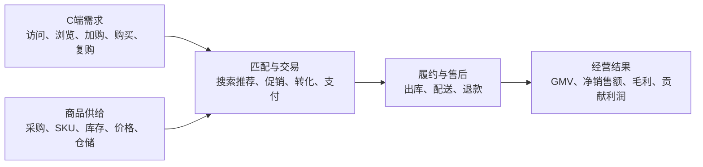

# 全渠道电商零售 Demo：业务模式

> 本文描述完全虚构的合成业务，仅用于 Hs 功能演示，不代表任何真实企业。

## 1. 业务定位

- demo_id：`demo-omnichannel-retail`
- 业务形态：全渠道自营电商零售。
- 商品范围：家居生活类商品，包括厨房用品、收纳用品、清洁用品和小家电。
- 销售渠道：自营 App、自营小程序和第三方电商平台。
- 核心经营目标：在保持履约和用户体验的前提下，实现贡献利润的可持续增长。

第一版不包含线下门店，也不包含商家入驻和平台佣金模式。第三方平台只是销售渠道，商品所有权、库存和履约责任仍由示例企业承担。

## 2. 业务如何运转



### C端需求侧

平台通过自然流量、付费投放、私域触达和内容合作获得访问用户，再通过商品详情、促销和购买流程完成转化。

核心问题：

- 流量是否增长，结构是否健康。
- 用户是否找到合适商品。
- 转化下降发生在哪一层。
- 新客能否被转成复购用户。

### 商品供给侧

企业向供应商采购商品，在区域仓维护库存，并通过类目、SKU、价格和库存共同构成可销售供给。

核心问题：

- 在售商品是否丰富。
- 商品是否有货。
- 价格与成本是否支持合理利润。
- 仓储和补货能否支撑销售机会。

### 匹配与交易

平台通过搜索、推荐、频道和营销活动，把用户需求与可售商品连接起来，并完成加购、下单和支付。

核心问题：

- 流量是否被匹配到合适商品。
- 转化提升来自商品、用户、渠道还是促销。
- 订单增长是否以过度折扣或低质量流量为代价。

### 履约与售后

订单支付后进入仓储和配送环节，最终形成完成订单、退款和客户体验。

核心问题：

- 履约是否准时。
- 缺货、延迟和质量问题是否带来退款。
- 表面 GMV 是否能转化为真实净销售额和利润。

## 3. 收入与利润结构

本 Demo 不把 GMV 当作唯一结果。

```text
GMV = 支付订单数 × 客单价
GMV = 销售件数 × 平均销售单价

净销售额 = GMV - 退款金额
毛利润 = 净销售额 - 商品成本
贡献利润 = 毛利润 - 营销费用 - 履约费用 - 渠道费用
```

这组关系用于检验：

- 同一个结果是否能沿多条公式链解释。
- 规模增长是否真正带来利润增长。
- 比率、人均值和单均值是否从基础分子分母重新计算。

## 4. 经营组织与区域

第一版包含三个区域、六个虚构城市和三个区域仓。区域负责销售与运营结果，中央团队负责采购、商品和营销规则。

组织层不是最终分析口径。一个经营问题可以按区域、城市、渠道、品类、用户类型或促销类型展开，具体取决于指标关系和命题。

## 5. 第一版业务边界

包含：

- 用户获取与转化漏斗。
- 商品、库存和类目供给。
- 订单、退款、收入和利润。
- 营销投放、渠道结构和获客效率。
- 仓储履约和区域差异。
- 新客与复购用户差异。

暂不包含：

- 线下门店。
- 入驻商家和平台抽佣。
- 会员订阅收入。
- 真实用户级明细和个人信息。
- 供应商合同、账期和现金流。

这些边界以后可以通过 `hs-graph` 扩充，但不得在第一版数据中悄悄加入。
