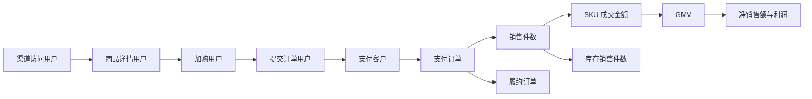

# 全渠道电商零售 Demo：数据生成契约

> 全部数据均为固定规则生成的虚构数据，仅用于 Hs 演示。本契约冻结 `N04` 的计算边界；生成器和 Source 卡不得绕过本文件另造口径。

## 1. 生成目标

- 时间范围：2024-01 至 2026-06，共 30 个完整自然月。
- 最低稳定分析粒度：月。
- 固定随机种子：`20260718`。
- 正常数据必须闭合；故意错误只允许进入 `datasets/bad_samples/`。
- 同一基础事实只生成一次，其他 Source 通过分配、聚合或公式引用。

## 2. 生成主链

派生指标不进入随机生成环节：转化率、购买频次、客单价、平均销售单价、退款率、有货率、准时履约率、获客成本、投放产出比和利润率，全部从基础分子分母回算。

## 3. Source 契约

| id | 文件 | 唯一键/粒度 | 权威基础字段 | 0 与缺失语义 |
|---|---|---|---|---|
| `SRC-0001` | `channel_traffic_funnel_monthly.csv` | 月×城市×渠道×流量来源×客户类型 | 访问、详情、支付客户 | 合法组合无结果记 0；不适用组合不生成 |
| `SRC-0002` | `product_behavior_funnel_monthly.csv` | 月×城市×渠道×一级品类×客户类型 | 详情、加购、提交、支付客户 | 合法组合无结果记 0 |
| `SRC-0003` | `order_transactions_monthly.csv` | 月×城市×渠道×一级品类×二级类目×客户类型×促销类型 | 支付客户、支付订单、销售件数、GMV、退款金额 | 合法组合无结果记 0；支付客户按主品类和主促销归因 |
| `SRC-0004` | `product_inventory_monthly.csv` | 月×城市×仓库×SKU | 在售、有货、月初库存、入库、销售、月末库存 | 无销售可记 0；缺行代表映射或生成错误 |
| `SRC-0005` | `financial_results_monthly.csv` | 月×城市×渠道×一级品类 | GMV、退款、净销售、成本和三项费用 | 财务结果不允许缺失；金额为 0 代表真实无发生 |
| `SRC-0006` | `marketing_campaigns_monthly.csv` | 月×城市×渠道×流量来源×活动 | 投放费用、可归因访问、新支付客户、净销售 | 只生成可归因投放；未覆盖营销不在本表 |
| `SRC-0007` | `fulfillment_monthly.csv` | 月×城市×仓库×一级品类 | 完成、准时完成、取消订单、平均时长 | 无订单可记 0；取消不进入准时率分母 |
| `SRC-0008` | `dimension_mappings.csv` | 单条有效映射 | 映射类型、父项、子项、生失效时间 | 缺行代表映射不存在，不得猜测 |

## 4. 跨表权威关系

1. `SRC-0001` 的详情和支付客户，按月、城市、渠道、客户类型聚合后，必须等于 `SRC-0002`。
2. `SRC-0002` 的支付客户，按主品类、主促销分配到 `SRC-0003`；在相同月、城市、渠道、一级品类、客户类型下必须闭合。
3. `SRC-0003` 的 SKU 销售底数向上形成交易表销售件数，同时写入 `SRC-0004`；两者按有效品类映射聚合后必须一致。
4. `SRC-0005` 的 GMV 和退款金额必须逐分等于 `SRC-0003` 的聚合结果；净销售额和利润只由本表基础字段计算。
5. `SRC-0006` 的投放费用和可归因净销售只代表可归因部分；费用不得超过 `SRC-0005` 的营销费用，可归因净销售不得超过对应渠道净销售额。
6. `SRC-0007` 满足 `支付订单数 = 已完成订单数 + 取消订单数`；准时完成订单数不得大于已完成订单数。
7. `SRC-0008` 是所有跨期层级关系的唯一映射来源，2026-01 的 SKU 归属变化不得回写历史。

## 5. 必须通过的校验

- 每张表唯一键无重复。
- 所有数量和金额非负。
- 漏斗逐层不增。
- 库存满足 `月末库存 = 月初库存 + 入库件数 - 销售件数`。
- GMV、退款、订单、件数和支付客户的跨表加总闭合。
- 所有比例由基础分子分母回算，父级比例不得对子级比例求平均。
- 业务事实的方向性信号可在数据中被验证，但不得要求每个明细单元都机械同向。
- 主数据存在任何 `fail` 时不得生成 Source 卡，不得进入 `N05`。

## 6. 坏样本隔离

坏样本只用于演示错误阻断：从订单交易月表复制一份并删除 `refund_amount` 字段。它必须：

- 位于 `datasets/bad_samples/`；
- 文件名明确包含 `missing_refund_amount`；
- 不被任何正常 Source 卡引用；
- 不进入主数据审计的加总范围。
