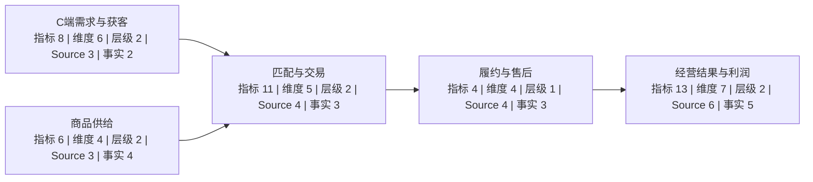

# 全渠道自营电商零售业务认知地图

> 本页由业务节点和绑定关系生成。全部 Source 卡和合成数据均已就绪；数量表示该节点可直接调用或用于交叉校验的 Source。

## 节点总览

| 节点 | 业务含义 | 指标 | 维度 | 层级 | Source | 事实 |
|---|---|---:|---:|---:|---:|---:|
| [C端需求与获客](../business_nodes/NODE-0001-c-demand.md) | 获得访问并形成商品兴趣 | 8 | 6 | 2 | 3 | 2 |
| [商品供给](../business_nodes/NODE-0002-product-supply.md) | 组织商品、库存与价格 | 6 | 4 | 2 | 3 | 4 |
| [匹配与交易](../business_nodes/NODE-0003-match-and-transaction.md) | 完成浏览、加购、下单与支付 | 11 | 5 | 2 | 4 | 3 |
| [履约与售后](../business_nodes/NODE-0004-fulfillment-and-after-sales.md) | 完成仓配并处理退款 | 4 | 4 | 1 | 4 | 3 |
| [经营结果与利润](../business_nodes/NODE-0005-results-and-profit.md) | 从规模还原净销售额与贡献利润 | 13 | 7 | 2 | 6 | 5 |

## 文件跳转

- [全部指标](../indexes/METRIC_INDEX.md)
- [全部资产](../indexes/ASSET_INDEX.md)
- [绑定关系](../bindings/BINDINGS.md)
- [数据源状态](../sources/README.md)
- [区域-城市-仓库层级](../hierarchies/HIER-0001-region-city-warehouse.md)
- [一级品类-二级类目-SKU层级](../hierarchies/HIER-0002-category-sku.md)
- [渠道-流量来源适用关系](../hierarchies/HIER-0003-channel-traffic-source.md)
- [九条业务事实](../facts/)

## 数据状态

1. 八份正常数据均由固定种子生成，可从 [数据生成器](../generator/generate_demo_data.py) 复现。
2. `SRC-0001` 至 `SRC-0008` 已绑定到指标、维度、层级和本地图。
3. 公式闭合、加总关系、粒度、业务事实方向和坏样本隔离已由 [审计报告](../datasets/audit/data_generation_audit.md) 验证。
4. 五类[演示任务与标准答案](../tasks/README.md)已经落地，并通过[发布回归](../datasets/audit/full_demo_regression.md)与独立工作区初始化校验。
