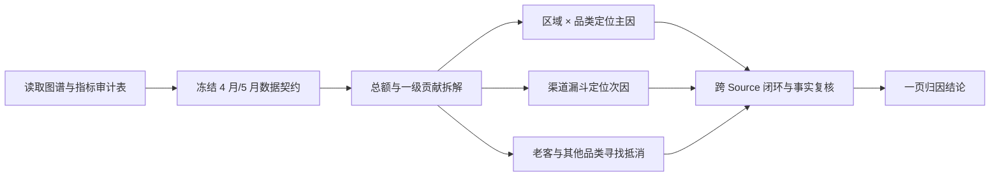

# TASK-0001：2026 年 5 月净销售额为什么下降

## 用户命题

使用 `demo-omnichannel-retail`，分析 2026 年 5 月净销售额相比 4 月为什么下降，区分主因、次因和抵消因素，并给出一页可汇报结论。

## 任务启动标准

- 强度：标准。
- 主题指标：[净销售额](../metrics/IND-0003-net-sales.md)。
- 对比口径：2026-05 环比 2026-04。
- 最低读取：`IND-0003 -> IND-0001 / IND-0002 -> IND-0026 / IND-0029 -> 漏斗、有货率、退款率`。
- 必读事实：`FACT-0007`、`FACT-0008`；检查 `FACT-0001` 是否构成抵消。
- 必读 Source：`SRC-0001` 至 `SRC-0007` 中命中指标的文件，`SRC-0008` 负责区域和品类映射。

## 预期施工图

## 中间表

1. 月度净销售额、GMV、退款金额与环比。
2. 区域、品类、渠道三张贡献拆解表。
3. 区域 × 品类交叉表。
4. 付费流量漏斗与供给、订单、老客频次验证表。

## Scope Gate

- 主因必须能量化到整体降幅，不能只凭事实卡讲故事。
- 流量增长不等于销售增长；必须检查流量质量和支付链路。
- 若跨 Source 加总不闭环，停止归因并转 `hs-feedback`。

## 交付要求

- 一句话结论。
- 主因、次因、抵消因素各一条，并附关键数字。
- 一张瀑布图或贡献表，一张机制验证图或表。
- 说明不能下的结论。
