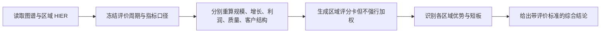

# TASK-0002：哪个区域综合表现最好

## 用户命题

使用 `demo-omnichannel-retail`，比较北区、东区和南区自 2025 年以来的综合经营表现，说明哪个区域最好、评价标准是什么、优势从哪里来。

## 任务启动标准

- 强度：标准。
- 时间：2025-01 至 2026-06；增长采用 2026H1 同比 2025H1。
- 评价维度：规模与增长、贡献利润率、退款率、准时履约率、新客获客成本、老客结构与购买频次。
- 必读 Source：`SRC-0003`、`SRC-0005`、`SRC-0006`、`SRC-0007`、`SRC-0008`。

## 预期施工图

## Scope Gate

- 不允许用单一规模指标宣布“最好”。
- 所有率类指标必须由区域聚合后的分子分母重算。
- 若用户改变评价目标，必须允许排名随之变化。

## 交付要求

- 区域综合评分卡。
- 综合表现判断及判定标准。
- 每个区域至少一项优势和一项风险。
- 明确“规模最好”“增长最好”“经营质量最好”不是同一结论。
