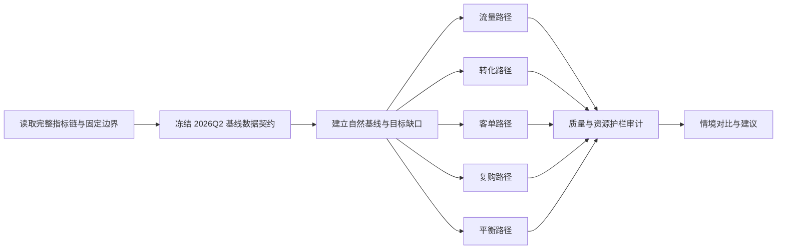

# TASK-0003：下一季度目标要承担什么压力

## 用户命题

以 2026Q2 实际净销售额作为下一季度自然经营基线，把目标提高 12%，比较流量、转化、客单、复购和平衡路径分别需要哪些过程指标承担压力。

## 任务启动标准

- 强度：重型。
- 主题指标：[净销售额](../metrics/IND-0003-net-sales.md)。
- 固定边界：不新增城市和仓库；在售 SKU 仅小幅变化；营销预算有上限；退款率、贡献利润率和准时履约率作为质量护栏。
- 关系型测算：必须通过基础量和公式反算，不把 +12% 同时套给全部过程指标。

## 预期施工图

## 中间表

1. 2026Q2 基线指标表。
2. 净销售额主链公式表。
3. 五条情境路径输入与反算表。
4. 退款率、贡献利润率、准时履约率、营销预算护栏表。
5. 缺口、所需资源和不可实现条件表。

## Scope Gate

- 本任务不预测真实未来，只演示目标压力反算。
- 单变量路径用于暴露压力，不默认推荐。
- 平衡路径只有在质量护栏不恶化时才可标记为可讨论。
- 数据不足时输出需要补充的资源或假设，不得强行闭合。

## 交付要求

- 基线、目标和绝对缺口。
- 五条路径的关键过程指标压力。
- 推荐路径及其约束。
- 不可实现时需要增加的资源或降低的目标。
