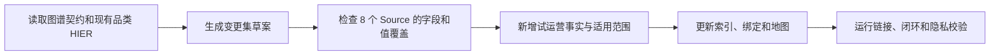

# TASK-0004：新增品类如何更新业务图谱

## 用户命题

为 `demo-omnichannel-retail` 增加“宠物生活”一级品类，先给出图谱变更计划，不直接修改资产；说明需要新增或修改哪些指标、维度、HIER、事实、Source 绑定和索引。

## 任务启动标准

- 强度：标准。
- 路径：`hs-entry -> hs-graph -> hs-feedback`。
- 变更性质：新增维度枚举和层级成员，不默认新增一套核心指标。
- 风险：数据源未覆盖、局部试运营被错误推广、历史映射被回写。

## 预期施工图

## Scope Gate

- 用户确认前不改真源。
- 维度出现名称不代表 Source 已有数据。
- 试运营效果不得直接推广到全部城市、渠道或客户。

## 交付要求

- 变更文件清单和每项改动。
- 必补数据清单。
- 生效时间、适用范围与回滚方法。
- 用户确认点和发布校验清单。
