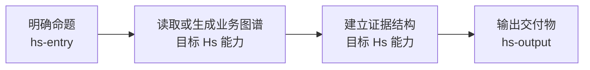

# Project Graph

`project_graph` 是 Hs Entry 为一次复杂任务生成的任务施工图。

它借鉴 Graphify 的项目图思想：先做轻量 Graph Scan，再把任务拆成节点、边、范围和闸门，让后续执行围绕这张图推进，避免在多轮分析、研究、建表和输出中偏离最初命题。

`project_graph` 记录计划，`run_record` 记录实际执行。两者必须使用同一组 `node_id`，但不能相互替代。运行记录契约见 `run-record-contract.md`。

## 数据型任务的发布链

当标准或重型任务需要读取、计算或呈现内部数据时，项目图必须在 Graph Scan 和用户确认之后，补上以下发布链：

`数据契约 -> 分析与中间测算 -> 指标审计 -> 表格构建 -> 最终交付`

| 节点 | 负责能力 | 必须产出 | 放行条件 |
|---|---|---|---|
| 数据契约 | `hs-data-contract` | 数据源、粒度、口径、映射、时间范围、空值语义、预期校验 | `ready` 或已披露条件的 `conditional` |
| 分析与中间测算 | `hs-analysis` | 证据结构、中间表清单、计算说明、业务解释 | 全部输入可追溯到数据契约 |
| 指标审计 | `hs-metric-audit` | 审计日志、异常和处置 | 无未解决 `fail`，标记 `release_ready` |
| 表格构建 | `hs-table-builder` | 数据源层、中间测算层、最终呈现层及交接表 | 最终表只引用审计通过的中间结果 |
| 最终交付 | `hs-output` | 报告、看板、结论卡或可分享文档 | 口径、截止日期、范围、条件可见 |

不需要数据计算的节点可标记 `not_applicable`，但必须写明原因。这个链条不能替代 Graph Scan；它只能使用已经从业务图谱、指标索引和 Source 卡中确认的路径。

## 1. 定位

`project_graph` 不是业务指标树，也不是长期知识图谱。

它只回答本轮任务：

- 要解决什么问题。
- 要覆盖什么范围。
- 已读取哪些业务图谱入口、指标节点和 source 卡。
- 要经过哪些步骤。
- 每一步调用哪个 Hs 能力。
- 每一步产出什么。
- 哪些节点必须校验或等待用户确认。
- 哪些结论只能在范围命中后输出。

## 2. 什么时候生成

轻量任务可以只输出任务启动卡，不强制生成完整 `project_graph`。

标准任务必须在轻量 Graph Scan 后生成，并先用用户可读施工图展示给用户确认。

重型任务必须在轻量 Graph Scan 后生成，并先用用户可读施工图展示给用户确认，尤其是以下情况：

- 同时涉及内部指标树和外部研究。
- 需要生成 Excel、HTML、报告、图表或可复用模板。
- 需要 ROI、目标测算、竞对对标、指标树回写。
- 用户命题表达复杂，容易在执行中漂移。
- 预计会跨多轮对话推进。

## 2.1 Graph Scan 前置规则

施工图不是纯粹的问题理解图。标准任务和重型任务的施工图必须在轻量 Graph Scan 后生成。

内部业务分析类任务，Graph Scan 至少读取：

- `business_graphs/registry.md`
- 目标业务 `manifest.md`
- `indexes/METRIC_INDEX.md`
- `indexes/ASSET_INDEX.md`
- 与命题直接相关的指标节点
- 这些指标节点链接到的 `sources/SRC-*.md`

外部研究类任务，如果没有内部业务树，Graph Scan 至少要明确：

- 研究对象
- 外部样本类型
- 可能的数据或公开来源
- 内部业务图谱是否需要后续映射

Graph Scan 只做路线识别：

- 不拉重数据。
- 不跑正式计算。
- 不输出业务结论。
- 不替代 `hs-analysis` 的临时指标审计表。

如果 Graph Scan 发现业务树、指标或 source 缺失，施工图必须把缺口写出来，并把后续节点改成“先补图谱/补数据源/降级分析”，不能假装路径完整。

## 3. 用户可读施工图 Markdown

标准任务和重型任务必须先展示施工图 Markdown，并等待用户确认。它是给用户看的执行路线，可以包含一张 Mermaid 线框路线图，但不追求复杂可视化包装。

写法目标：

- 让用户一屏看懂：这次要解决什么、怎么推进、会交付什么。
- 把关键边界提前暴露：看哪些范围，不看哪些范围。
- 让用户有机会在执行前纠偏。
- 优先使用 Mermaid 线框路线图 + 普通 Markdown 标题、列表和必要表格。
- 线框图只展示节点和依赖关系；范围、证据、产物、边界和确认项必须继续用文字说明，不能只画图。

默认结构：

````markdown
## 施工图

我准备按这条路线推进，你先确认一下。



**这次要解决什么**
- 我理解的真实问题：
- 最终要交付给谁看：
- 预期产物：

**我会先看哪些范围**
- 业务对象：
- 时间窗口：
- 指标或研究路径：
- 数据源或样本来源：

**Graph Scan 已确认**
- 使用的业务树：
- 已读取的图谱入口：
- 初步纳入的指标或研究路径：
- 已知数据源：
- 当前缺口：

**数据型任务的发布链（适用时）**
- 数据契约：
- 分析与中间测算：
- 指标审计：
- 表格构建：
- 最终交付：

**执行路线**
1. 先：
2. 再：
3. 最后：

**这次先不做什么**
- 不覆盖：
- 暂不下结论：

**需要你确认**
- 范围是否对。
- 交付物是否对。
- 是否可以开始第一步。
````

线框图写法要求：

- 节点名必须是可执行动作，不是抽象愿望。
- 节点里可以标注调用能力，例如 `hs-analysis`、`hs-research`、`hs-onboarding`、`hs-output`。
- 标准任务建议 3-5 个节点；重型任务可以 5-7 个节点，但不要把所有细节塞进图里。
- 图里的每个主要节点，必须能在后台 `project_graph` 的 `Nodes` 中找到对应项。
- 不要在通用模板中写入任何具体公司、行业、业务线或历史项目。

确认规则：

- 输出施工图 Markdown 后必须停住。
- 只有用户明确回复“确认”“开始”“继续”“按这个来”或等价表达后，才能进入后续 Skill。
- 用户修改范围、交付物或路径时，先更新施工图，再继续。

## 4. 后台 Project Graph 最小结构

后台 `project_graph` 是给后续 Hs 能力读取的执行约束。它可以保存成 Markdown 或 JSON，但不应作为默认用户展示形态。

```markdown
## Project Graph

### Task
- run_id：
- run_record：
- 用户原始问题：
- 真实命题：
- 目标交付物：
- 交付对象：
- 任务强度：

### Scope Gate
- 业务对象：
- 时间窗口：
- 指标路径：
- 数据源范围：
- 外部样本范围：
- 必须命中的范围：
- 不覆盖的范围：

### Graph Scan
- 使用的业务树：
- 已读取的图谱入口：
- 已读取的指标节点：
- 已读取的 source 卡：
- 初步纳入路径：
- 暂不纳入路径：
- 已知缺口：

### Nodes
| node_id | 节点 | 调用能力 | 输入 | 输出 | 状态 | 是否需确认 |
|---|---|---|---|---|---|---|

### Edges
| from | to | 关系 | 通过条件 |
|---|---|---|---|

### Deliverables
| 产物 | 用途 | 格式 | 保存位置 |
|---|---|---|---|

### Checkpoints
| 检查点 | 检查什么 | 不通过时怎么办 |
|---|---|---|
```

## 5. 节点规则

节点必须是可执行步骤，不能是抽象愿望。

好节点：

- 基于 Graph Scan 生成临时指标审计表。
- 冻结某个稳定计算单元的数据契约。
- 建立可追溯的中间测算表。
- 审计父子闭环、分子分母和可比性。
- 从审计通过的中间表构建最终看板。
- 采样外部对标案例。
- 建立 ROI 对比中间表。
- 输出给业务负责人看的结论卡。

坏节点：

- 做深度分析。
- 研究一下。
- 看看有没有机会。
- 输出一个好的报告。

通用性要求：

- 通用 Skill 的规则、模板和示例不得绑定任何具体公司、行业、业务线或历史项目。
- 具体业务只能出现在业务图谱、测试报告、案例库或用户本轮输入中。
- 需要举例时，使用“本轮指定业务”“目标业务对象”“某个局部对象”“外部对标案例”等抽象表达。

## 6. Scope Gate

`Scope Gate` 是防止“结论看起来完整，但其实只覆盖局部”的闸门。

每次复杂任务必须明确：

- 预期覆盖哪些业务对象。
- 预期覆盖哪些指标路径。
- 预期覆盖哪些时间窗口。
- 预期覆盖哪些数据源或外部样本。
- 实际命中了哪些。
- 缺失是否影响最终结论。

如果预期范围和实际命中不一致，结论必须降级：

- 完整结论 -> 局部结论
- 诊断结论 -> 初步观察
- 方向判断 -> 待验证假设

典型 Bad Case：

- 本来要分析全部目标对象，却因为层级空值只命中一个局部对象。
- 本来要解释业绩下滑，却只看了新签，没有看续费和充值路径。
- 本来要比较多种方案 ROI，却没有列出所有可选路径。

## 7. 来源与置信度

`project_graph` 可以记录来源和置信度，但不要让前台叙事变僵硬。

后台字段：

- `source`：用户输入 / 指标树 / 数据源 / 外部链接 / 系统推断。
- `confidence`：明确提取 / 系统推断 / 待确认。

使用原则：

- 关键范围、关键指标、关键外部样本应记录来源。
- 不要求报告正文每句话都带来源。
- 置信度用于决定是否能进入结论，不用于装饰报告。

## 8. 后续能力如何使用

所有后续 Hs 能力在接到 `project_graph` 后，必须先读取它，再执行自己的任务。标准任务和重型任务的 `project_graph` 必须包含 Graph Scan 摘要。

标准和重型任务还必须读取同目录的 `run_record`，并按 `run-record-contract.md` 在节点完成、阻塞、用户纠正和回归验证时追加最小事件。运行记录只证明实际执行，不替代任何业务或数据真源。

- `hs-onboarding`：确认自己只负责图谱或业务框架节点，不替代后续分析。
- `hs-analysis`：先读取 Graph Scan 摘要，再按 `Scope Gate` 检查指标、时间、对象和数据源覆盖；随后仍要自己输出临时指标审计表，不能只依赖 Entry 的预扫描。
- `hs-data-contract`：只使用 Graph Scan 已确认的业务图谱、指标节点和 Source 卡冻结数据边界，不能自行猜测来源或口径。
- `hs-metric-audit`：读取数据契约和中间结果，独立检查是否满足发布门槛。
- `hs-table-builder`：只从审计通过的中间结果构建数据源层、中间测算层和最终呈现层。
- `hs-research`：按外部样本范围采样，不能把单个案例当完整对标。
- `hs-output`：按 `Deliverables` 和交付对象选择产物格式。
- `hs-feedback`：当执行偏离 `project_graph`，读取运行记录，把偏离定位为 Bad Case 并进入受控回写。

如果标准任务或重型任务没有看到 `project_graph`，或 `project_graph` 没有 Graph Scan 摘要，后续能力必须停止执行，并要求先回到 `hs-entry` 补齐施工图。

## 9. 保存位置

若生成文件，默认保存到：

```text
outputs/hs_entry/{YYYYMMDD}_{task_name}/project_graph.md
```

同一目录必须初始化：

```text
outputs/hs_entry/{YYYYMMDD}_{task_name}/run_record.md
```

重型任务可以同时生成机器可读版：

```text
outputs/hs_entry/{YYYYMMDD}_{task_name}/project_graph.json
```

第一版可以只生成 Markdown。只有当后续自动读取变得稳定时，再要求 JSON。
