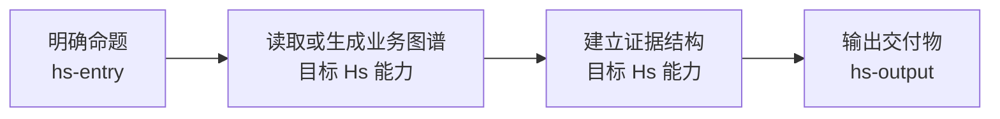

# Routing Rules

## 任务启动卡

每次使用 `hs-entry`，默认先输出任务启动卡。入口的目标不是完成分析，而是确认是否已经足以调用下一层 Hs Skill。

```markdown
## 任务启动卡

- 我理解你的真实问题是：
- 目标交付物是：
- 证据来源是：
- 推荐调用路径是：
- 执行前还缺：
- 我建议的第一步是：
```

标准任务和重型任务必须先做轻量 Graph Scan，再补充用户可读施工图，并等待用户确认。施工图优先使用 Mermaid 线框路线图 + 必要字段和表格；线框图只展示执行节点关系，不能替代范围、证据、产物和确认项。

Graph Scan 的目标是让施工图基于业务图谱事实，而不是只基于用户自然语言猜路线。它只读取必要的图谱入口、指标索引、相关指标节点和 source 卡，不拉重数据、不跑正式计算、不输出业务结论。

若任务需要读取、计算或呈现内部数据，施工图确认后的默认数据链为：

`hs-data-contract -> hs-analysis -> hs-metric-audit -> hs-table-builder -> hs-output`

这不是新增的前台场景分类，而是同一任务内部的稳定功能交接。任何节点都不得绕过已确认的 Graph Scan、项目图或上游放行条件。

````markdown
## 施工图

我准备按这条路线推进，你先确认一下。



**这次要解决什么**
- 我理解的真实问题：
- 最终要交付给谁看：
- 预期产物：

**我会先看哪些范围**
- 业务对象：
- 时间窗口：
- 指标或研究路径：
- 数据源或样本来源：

**Graph Scan 已确认**
- 使用的业务树：
- 已读取的图谱入口：
- 初步纳入的指标或研究路径：
- 已知数据源：
- 当前缺口：

**执行路线**
1. 先：
2. 再：
3. 最后：

**这次先不做什么**
- 不覆盖：
- 暂不下结论：

**需要你确认**
- 范围是否对。
- 交付物是否对。
- 是否可以开始第一步。
````

同时生成后台 `project_graph`，供后续 Hs 能力读取。完整规则见 `project-graph.md`。

## 路由规则

### 1. 先判断有没有业务图谱

- 没有业务描述、指标树或业务认知地图：先 `hs-onboarding`。
- 有业务图谱但用户没有指定业务：如果存在多棵业务树，先问用户选择哪棵。
- 用户要新增、修改、废弃、关联指标树资产，或维护业务树总览、索引、绑定关系、数据源说明：走 `hs-graph`。
- 用户指出结果错误、漏项、跑偏、输出不可读、需要回写或修系统：走 `hs-feedback`。
- 有业务图谱且命题明确：继续判断 analysis、research、graph 或 output。

### 2. 判断内部还是外部

- 主要证据来自内部指标、数据表、业务事实：`hs-analysis`。
- 主要证据来自外部行业、竞对、公开案例、财报、评论、招聘、样本：`hs-research`。
- 主要目标是让业务图谱资产变得更完整、更一致、更可读：`hs-graph`。
- 主要目标是处理一次 Hs 使用中的 Bad Case、纠错或产品改进：`hs-feedback`。
- 外部案例要用于内部决策：先 `hs-research` 生成假设，再 `hs-analysis` 做内部验证。

### 3. 判断任务复杂度

- 轻量：一句判断、回答话术、简单框架。
- 标准：证据结构、指标路径、表格蓝图、关键结论。
- 重型：完整报告、HTML、图表、可复用模板或指标树回写。

判断规则：

- 用户只要快速判断或表达辅助：轻量。
- 用户需要内部数据、指标树、外部研究中的任意一类证据：标准。
- 用户同时涉及外部采样、内部指标树、ROI/测算、完整报告、可复用模板或指标树回写中的两类以上：重型。

默认用标准；用户只想快速讨论时用轻量。标准和重型任务必须先完成 Graph Scan，再输出施工图 Markdown，确认后再执行。

### 3.1 Project Graph 触发

标准任务必须先完成 Graph Scan，再生成 `project_graph`，并先展示施工图 Markdown。

重型任务必须先完成 Graph Scan，再生成 `project_graph`，并先展示施工图 Markdown。后台 `project_graph` 至少包含：

- Task：原始问题、真实命题、目标交付物。
- Graph Scan：使用的业务树、读取过的索引、相关指标节点、source 卡和已知缺口。
- Scope Gate：业务对象、指标路径、时间窗口、数据源或外部样本范围。
- Nodes：每一步调用哪个能力、输入和输出是什么。
- Edges：步骤之间的依赖和通过条件。
- Checkpoints：不通过时是否降级、暂停或转入 Feedback。

后续能力必须先读 `project_graph`，再执行本节点任务。若没有看到 `project_graph`，或 `project_graph` 中没有 Graph Scan 摘要，不得继续执行标准或重型任务。

### 4. 判断是否需要先问

只在以下情况提问：

- 不知道目标交付物，导致无法判断调用哪个 Skill。
- 不知道证据来源，导致无法判断走 `hs-analysis`、`hs-research` 还是 `hs-onboarding`。
- 不知道具体业务，且项目里可能有多棵业务树。
- 缺少时间范围、对比口径或决策对象，导致分析不可执行。

最多问 3 个问题。能合理假设时，先声明假设继续。

不要为每类前台场景设计一套庞大的问题卡。入口只需要把用户信息明确到足以调用下一层 Skill。

## 常见路径

```text
写述职/复盘/简历/老板追问
-> hs-analysis

不知道自己的业务该看什么指标
-> hs-onboarding

研究竞对/行业/商业机会
-> hs-research

研究竞对后想判断自己能不能做
-> 任务启动卡 -> hs-research -> hs-analysis

维护指标、维度、层级、数据源、业务事实、索引或总览
-> hs-graph

复盘这次为什么错 / 漏了什么 / 需要回写到系统
-> hs-feedback

已有数据但不知道怎么组织成报告
-> hs-entry 判断场景 -> hs-analysis
```

## 记录前台场景

如果用户提出一个新场景，且它可能成为未来独立 Skill：

1. 先不要新建 Skill。
2. 在输出中标注“潜在前台场景”。
3. 记录它调用了哪些后台能力。
4. 等这个场景重复出现或形成独特交付规则后，再考虑拆分。
